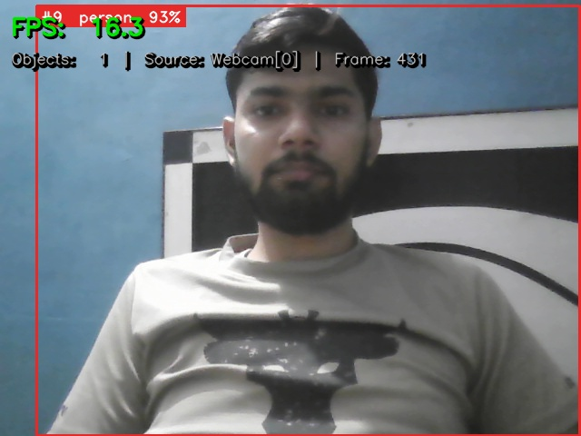
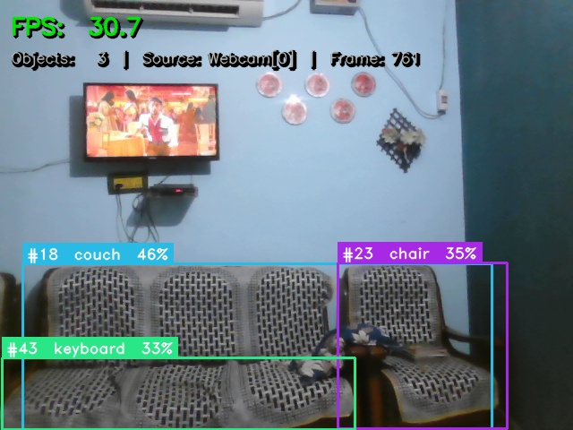
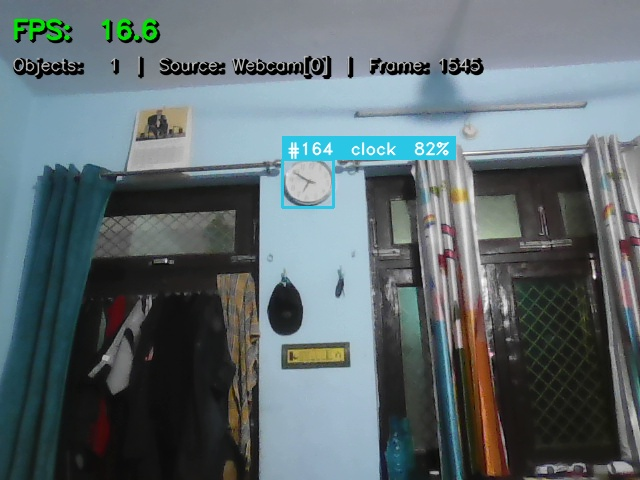

# 🎯 Real-Time Object Detector

> A high-performance real-time object detection system built using **YOLOv8**, **ByteTrack**, and **OpenCV** for accurate multi-object detection and tracking.


---

## 📌 Overview

**Real-Time Object Detector** is a computer vision application capable of detecting and tracking multiple objects from a webcam or video stream in real time.

Powered by **YOLOv8** for object detection and **ByteTrack** for robust object tracking, the application delivers fast and accurate performance suitable for surveillance, traffic monitoring, smart automation, and AI-based vision systems.

---

## ✨ Features

- 🎥 Real-time webcam object detection
- 🎯 Multi-object detection
- 📍 ByteTrack object tracking
- ⚡ High-speed inference
- 🖥️ Simple Python interface
- 📦 Easy to run locally
- 🚀 Modular project structure

---

## 🛠️ Tech Stack

- Python
- OpenCV
- Ultralytics YOLOv8
- ByteTrack
- NumPy

---

## 📸 Screenshots

### 🏠 Home Screen



### 🎯 Object Detection



### 📊 Detection Result



## 📂 Project Structure

```text
Real-Time-Object-Detector/
│
├── detector.py
├── main.py
├── utils.py
├── requirements.txt
├── home.png
├── result.png
└── README.md
```

---

## ⚙️ Installation

```bash
git clone https://github.com/pratikeyyy/Real-Time-Object-Detector.git

cd Real-Time-Object-Detector

pip install -r requirements.txt

python main.py
```

---

## 🚀 Applications

- Smart Surveillance
- Traffic Monitoring
- Retail Analytics
- Security Systems
- AI Vision Projects
- Smart City Solutions

---

## 📈 Future Improvements

- Custom YOLO model support
- GPU optimization
- Video file detection
- Object counting
- Face recognition integration
- Web deployment

---

## 👨‍💻 Author

**Pratik Kumar**

GitHub: https://github.com/pratikeyyy

---

⭐ If you found this project useful, consider giving it a Star.
